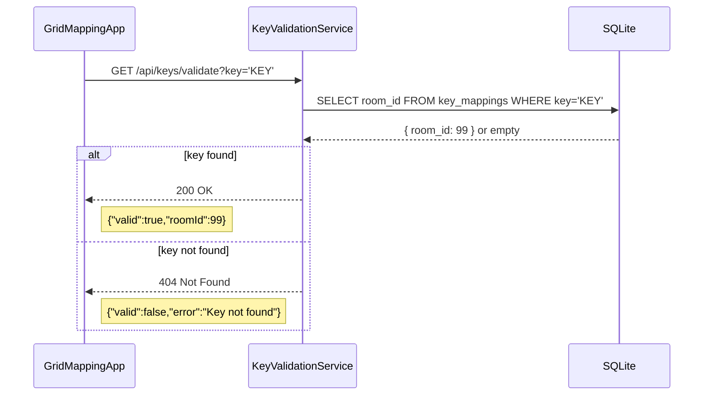

# Key-Validation Service

> 🔑 **Key-Validation Service**  
> A lightweight Node.js/Express microservice that validates user-provided keys against a persistent SQLite datastore.

---

## Table of Contents

1. [Communication Contract](#communication-contract)
2. [Installation & Usage](#installation--usage)
3. [UML Sequence Diagram](#uml-sequence-diagram)
---

## Communication Contract

### Endpoint

```http
GET /api/keys/validate?key=<KEY>
```

### Request

* **Query Parameter**: `key` (string) — the key to validate.

### Responses

* **200 OK**

  ```json
  {
    "valid": true,
    "roomId": 99
  }
  ```
* **404 Not Found**

  ```json
  {
    "valid": false,
    "error": "Key not found"
  }
  ```
* **503 Service Unavailable**

  ```json
  {
    "error": "Database unavailable — please try again later."
  }
  ```

---

## Installation & Usage

```bash
# Clone the microservice repository
git clone https://github.com/your-org/CS361-Microservice-A.git

# Navigate to the microservice folder
cd CS361-Microservice-A

# Install dependencies
npm install

# Start the service (default port: 4000)
npm start
```

> **Note:** The service persists keys in `keys.db`. To insert a test key, run:
>
> ```bash
> sqlite3 keys.db \
>   "INSERT OR IGNORE INTO key_mappings(key,room_id) VALUES('TEST-KEY-123', 99);"
> ```
>
> Test via `curl`:
> ```bash
> # known key
> curl "http://localhost:4000/api/keys/validate?key=TEST-KEY-123"
> ```
>
> ```bash 
> # unknown key
> curl "http://localhost:4000/api/keys/validate?key=WRONGKEY"
> ```

---

## UML Sequence Diagram


