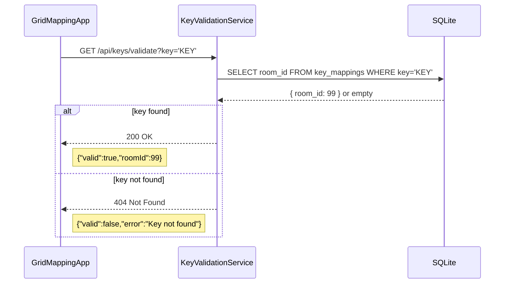

# Key-Validation Service

> 🔑 **Key-Validation Service**  
> A lightweight Node.js/Express microservice that validates user-provided keys against a persistent SQLite datastore.

---

## Table of Contents

1. [Communication Contract](#communication-contract)
2. [Installation & Usage](#installation--usage)
3. [UML Sequence Diagram](#uml-sequence-diagram)
---

## Communication Contract

### Endpoint

```http
GET /api/keys/validate?key=<KEY>
```

### Request

* **Query Parameter**: `key` (string) — the key to validate.

### Responses

* **200 OK**

  ```json
  {
    "valid": true,
    "roomId": 99
  }
  ```
* **404 Not Found**

  ```json
  {
    "valid": false,
    "error": "Key not found"
  }
  ```
* **503 Service Unavailable**

  ```json
  {
    "error": "Database unavailable — please try again later."
  }
  ```

---

## Installation & Usage

```bash
# Clone the microservice repository
git clone https://github.com/hayakzan/CS361-Microservice-A.git

# Navigate to the microservice folder
cd CS361-Microservice-A

# Install dependencies
npm install

# Start the service (default port: 4000)
npm start

# (Optional) If using the Python test script, install requests:
# Create and activate a virtual environment, then:
# python3 -m venv venv
# source venv/bin/activate
# pip install requests

```

## Example Client Call (Python)

```python
import requests

def test_key(key: str):
    url = f"http://localhost:4000/api/keys/validate?key={key}"
    print(f"Requesting key: {key!r}")
    
    try:
        resp = requests.get(url, timeout=5)
    except requests.RequestException as e:
        print(f"Request failed: {e}")
        return

    print(f"HTTP {resp.status_code}")
    try:
        data = resp.json()
    except ValueError:
        print(f"Invalid JSON response:
{resp.text}")
        return

    if resp.status_code == 200:
        print(f"valid={data.get('valid')}, roomId={data.get('roomId')}")
    elif resp.status_code == 404:
        print(f"valid={data.get('valid')}, error={data.get('error')}")
    else:
        print(f"Unexpected response: {data}")
```
See the full Python example in [`test.py`](test.py).

---

## UML Sequence Diagram


